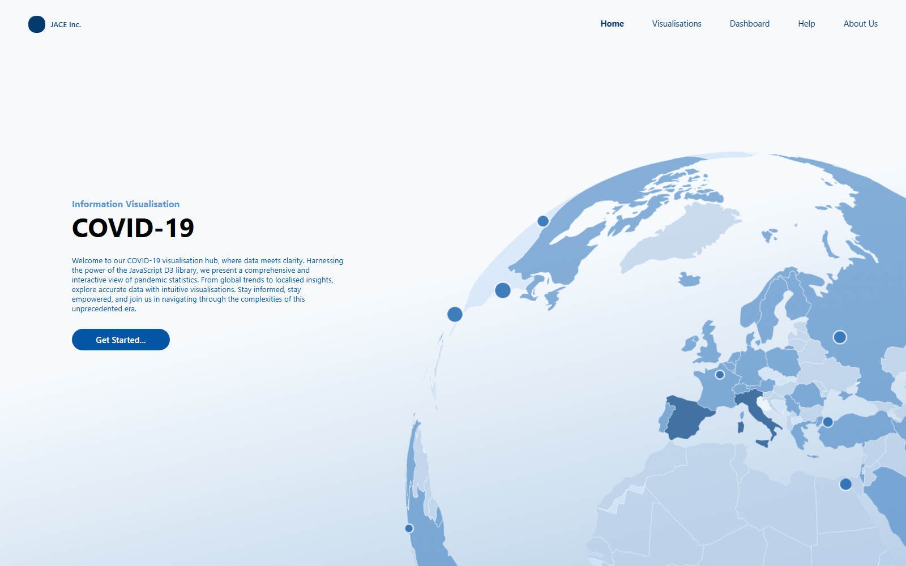
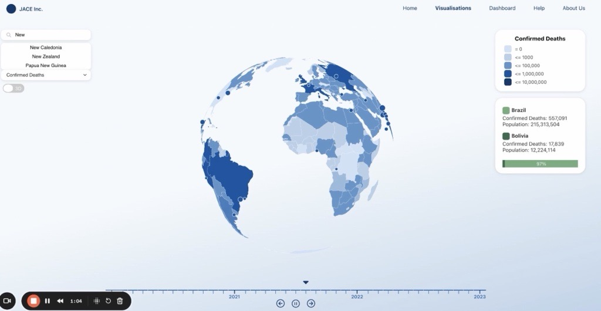
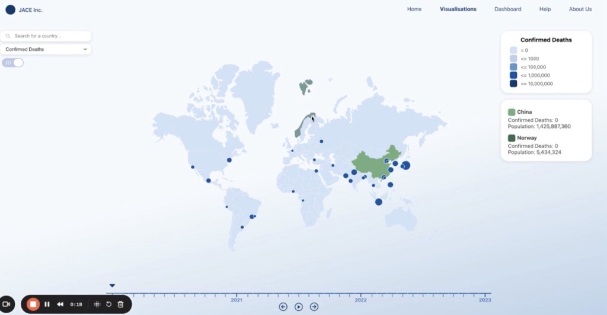
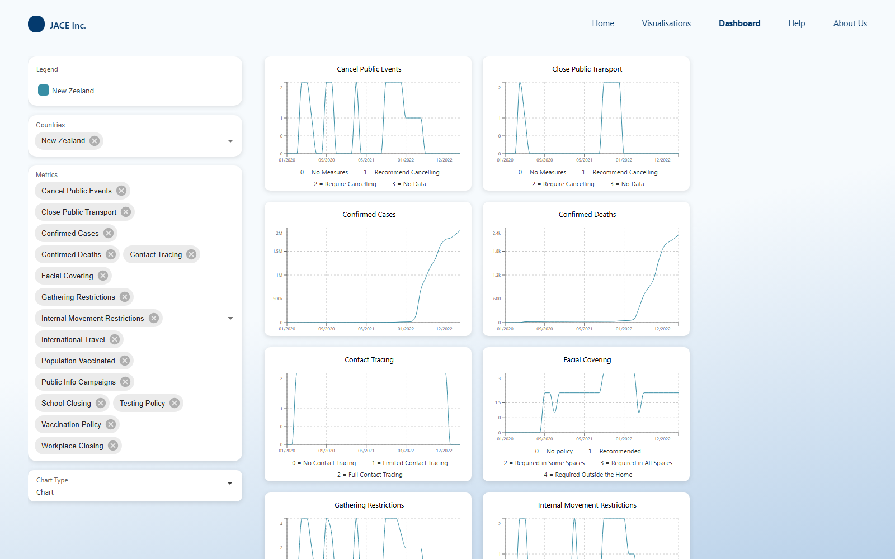
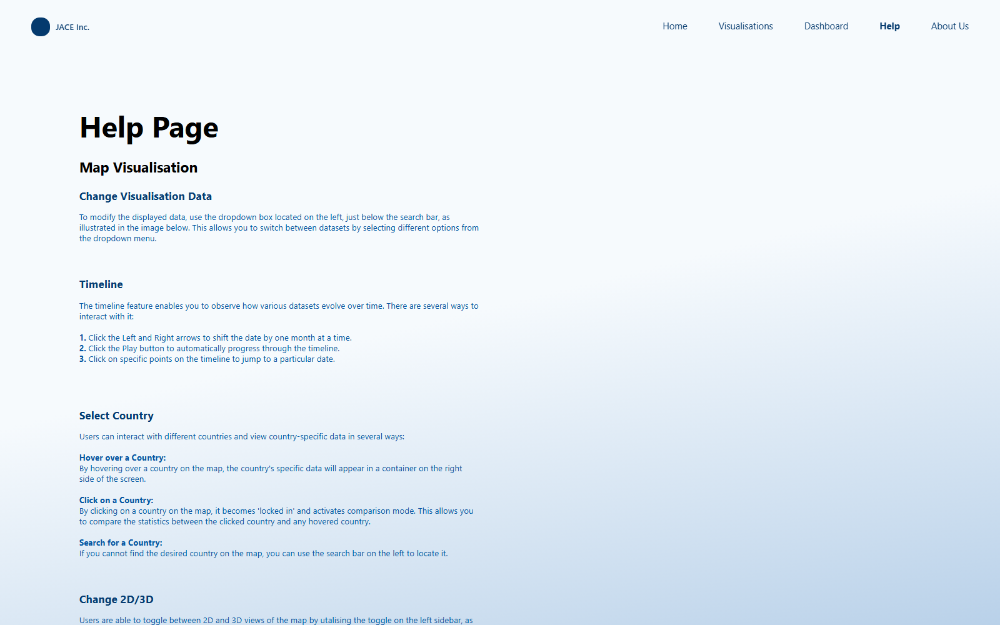
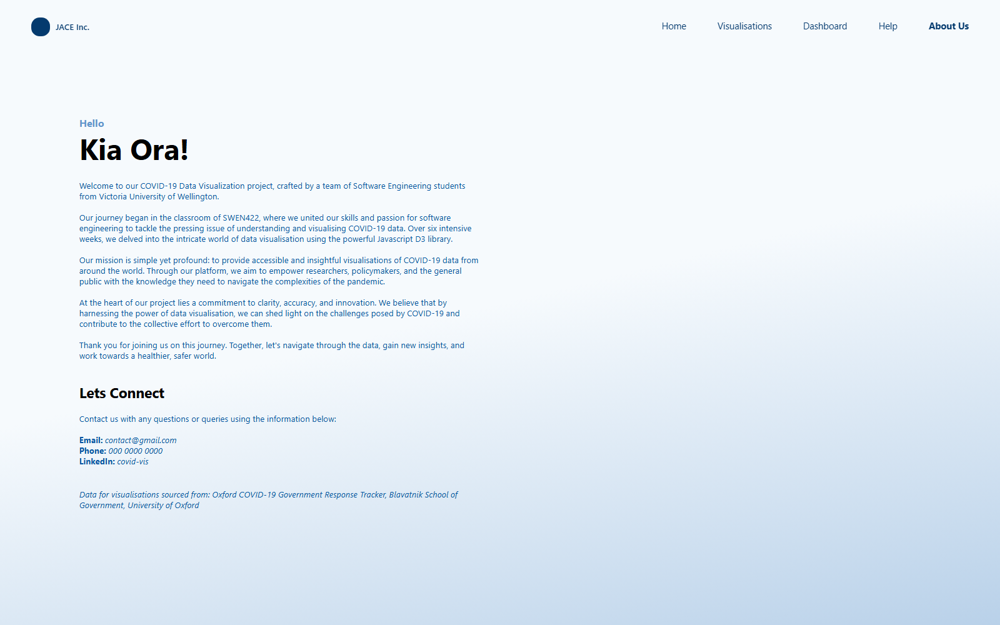

# COVID-19 Visualiser

An interactive web app for exploring COVID-19 data and government response measures around the world, built with **React** (TypeScript + JavaScript) and **D3.js**. Data is sourced from the [Oxford COVID-19 Government Response Tracker](https://github.com/OxCGRT/covid-policy-dataset) (Blavatnik School of Government, University of Oxford).

## Tech Stack

- **[React 18](https://react.dev/)** (Create React App / `react-scripts`) with TypeScript and `react-router-dom` for client-side routing between pages
- **[D3.js](https://d3js.org/)** (`d3-geo`, `topojson`/`topojson-client`) for the interactive 2D/3D world map projections and geography rendering
- **[Recharts](https://recharts.org/)** for the dashboard's line/area/bar charts
- **[MUI](https://mui.com/)** (`@mui/material`, `@mui/joy`, `@mui/icons-material`) and `@emotion` for UI components and styling
- **PapaParse** for CSV parsing of the underlying dataset
- React Context (`CovidContext`) for sharing selected/hovered/searched country and timeline state across pages

## Pages

The app has five pages, navigable via the top nav bar (`src/Pages/NavBar.jsx`), all rendered lazily under a shared `CovidContext` provider (`src/App.tsx`).

### Home (`/`)
Landing page introducing the project, with a parallax globe graphic and a "Get Started" link into the Visualisations page.



### Visualisations (`/visualisations`)
The core interactive world map (`WorldMap.jsx`), built with `d3-geo`. Users can:
- Search for a country via the search bar
- Switch which dataset is colour-coded on the map (e.g. Confirmed Cases, Vaccination Policy, Facial Covering) via the dropdown
- Toggle between a 2D (Mercator) and 3D (orthographic/globe) projection
- Scrub through time using the timeline at the bottom to see how the map changes month-by-month from 2020–2023
- Hover a country to preview its stats, or click to "lock in" a country and compare it against another hovered country
- View the colour legend/key for the currently selected metric

| 3D globe with country search | 2D map with country comparison |
|---|---|
|  |  |

### Dashboard (`/dashboard`)
A multi-country, multi-metric charting dashboard (`DashboardPage.tsx`) for comparing trends over time. Users can:
- Select one or more countries and one or more metrics via multi-select dropdowns (selections persist to `localStorage`)
- Switch chart type between Line, Area, and Bar charts (Recharts)
- Each metric gets its own chart card, colour-coded per country via a legend, with a threshold key explaining what each value/level means
- Click a chart to expand it in a modal for a closer look



### Help (`/help`)
Static documentation page explaining how to use the Map Visualisation (changing data, using the timeline, selecting countries, toggling 2D/3D) and the Chart Dashboard (adding countries/metrics, changing chart type, expanding charts).



### About Us (`/aboutus`)
Background on the project team (Software Engineering students from Victoria University of Wellington, built as part of SWEN422) and contact/data source information.



## How to Start the Program

### Required Dependencies
- Node
- NPM

### Steps to Start the Program
1. Navigate to the project directory:
    ```bash
    cd covid-visualiser
    ```
2. Install the necessary packages:
    ```bash
    npm install
    ```
3. Start the program:
    ```bash
    npm start
    ```
4. Open [http://localhost:3000](http://localhost:3000) in your browser.

## Video Link
[Watch the demo video](https://www.loom.com/share/4d13a48811844383805d0184171a47b3?sid=de1de55a-9fb9-4a57-9cb5-e33a22c9017c)
